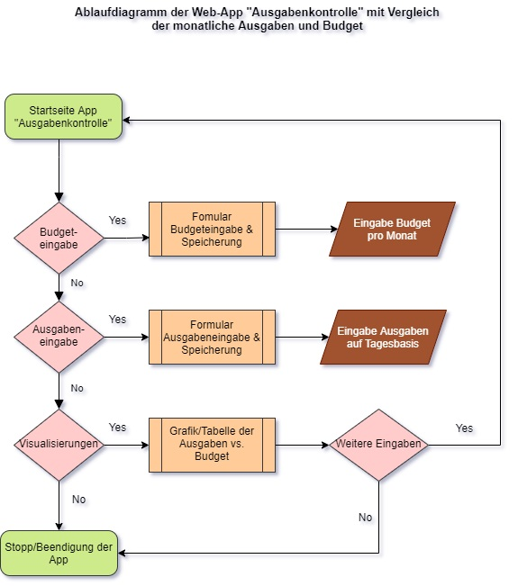

## Ausgangslage
<!-- Italics -->
Im Rahmen des Master-Studiengangs Information & Data Mangement
an der FH Graubünden soll im Modul Python 2 eine Web-App erstellt werden.
Die Programmierung basiert auf Python, wird aber mithilfe von PyCharm
auf eine Web-Umgebung vorbereitet und auf GitHub dokumentiert.

***

## Projektidee "App Ausgabenkontrolle" / Funktionen
<!-- Italics -->
Grundlegend ist die **Projektidee**, eine Web-App zu entwickeln, mit der die täglichen
Geldausgaben in ein Formular eingegeben und mit einem Ausgaben-Oberthema gespeichert werden (*inkl. Tagesdatum*).
Gleichzeitig soll in einem anderen Formular ein Monatsbudget für jeden Monat definiert werden
können, welches ebenfalls abgespeichert wird, aber hier im Monatsformat. Als Abschluss sollen die
monatlichen Ausgaben und das Budget mit einem Diagram visualisiert werden. Zusätzlich sollen die Ausgaben in
einer Tabelle übersichtlich dargestellt werden.

Folgende **Funktionen** soll sie beinhalten:
1. Eingabe & Speicherung der Monats-Budgets
2. Eingabe & Speicherung der Tagesausgaben
3. Visualisierung Ausgaben vs. Budget

***

## Workflow
### Dateneingabe
<!-- Italics -->
Die Dateneingabe der täglichen Geldausgaben, wie auch das
monatlich definierte Budget soll über Formulare möglich sein.
Dabei soll vor allem bei den Ausgaben auch noch ein Oberthema
aus einer Auswahl ausgewählt werden, mit dem die Ausgaben klassifiziert
werden können.
### Datenverarbeitung/Speicherung
<!-- Italics -->
Die täglichen Ausgaben und monatlichen Budget, welche über die Formulare
erfasst wurden, werden mit Datum in eine JSON-Datei gespeichert.
### Datenausgabe
<!-- Italics -->
Die erfassten und gespeicherten Daten sollen einerseits in Tabellenform
visualisiert werden, andererseits aber auch in einer passenden Grafik (Diagramm)
zusätzlich visualisiert werden, damit der Vergleich Ausgaben vs. Budget ersichtlich wird.

***

## Ablaufdiagramm
<!-- Italics -->

***

