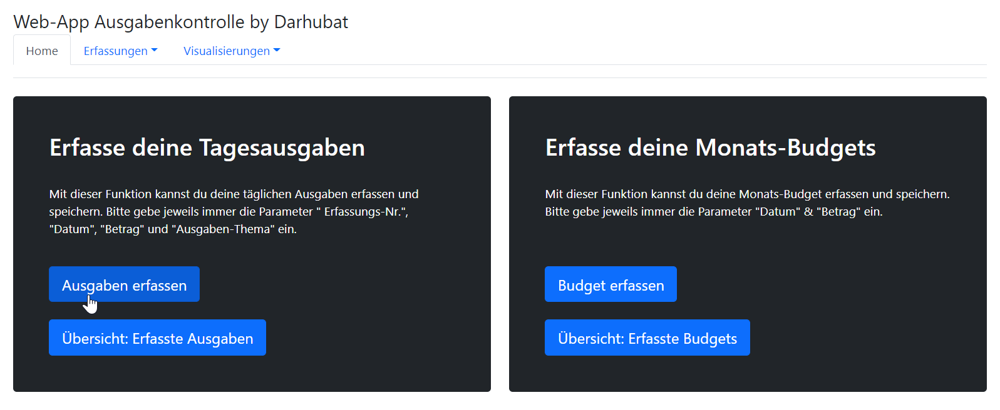
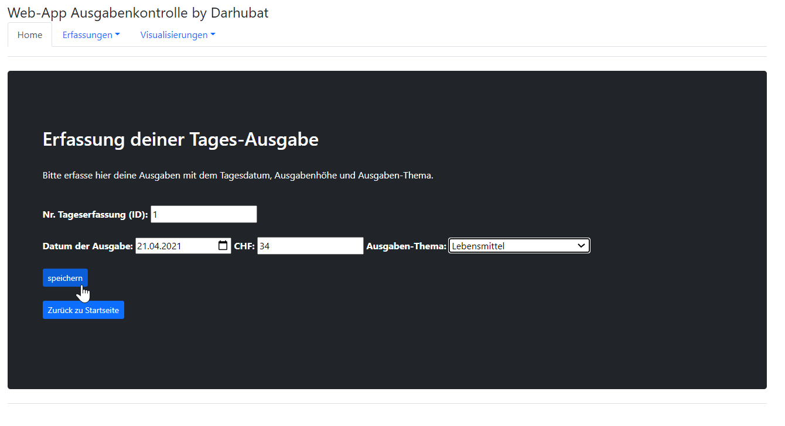
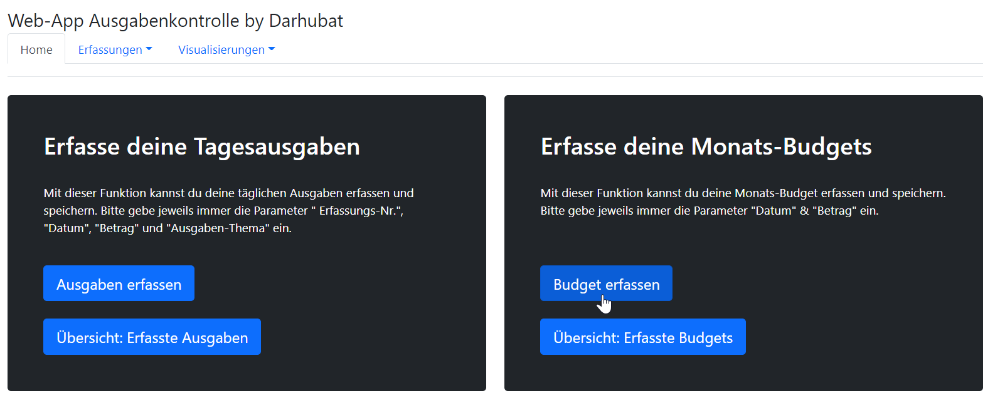
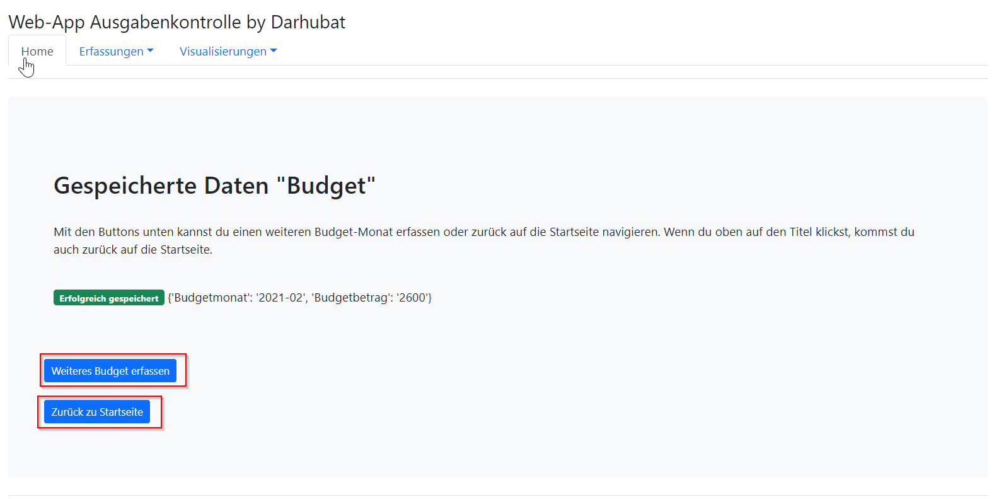
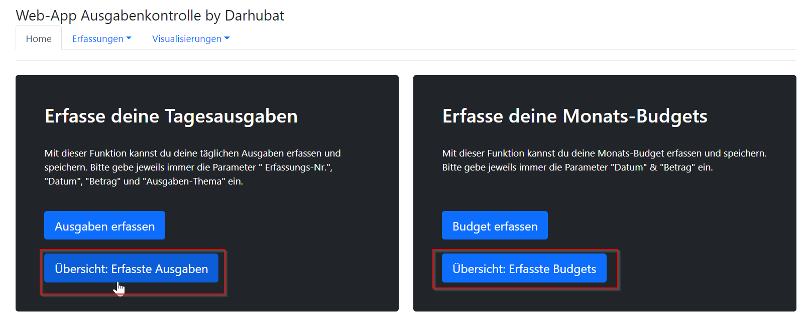
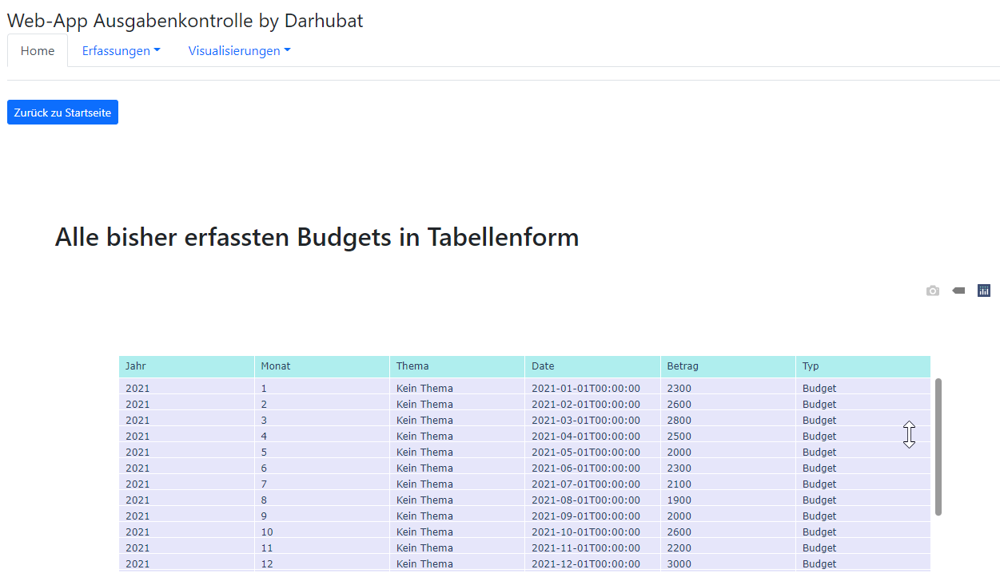
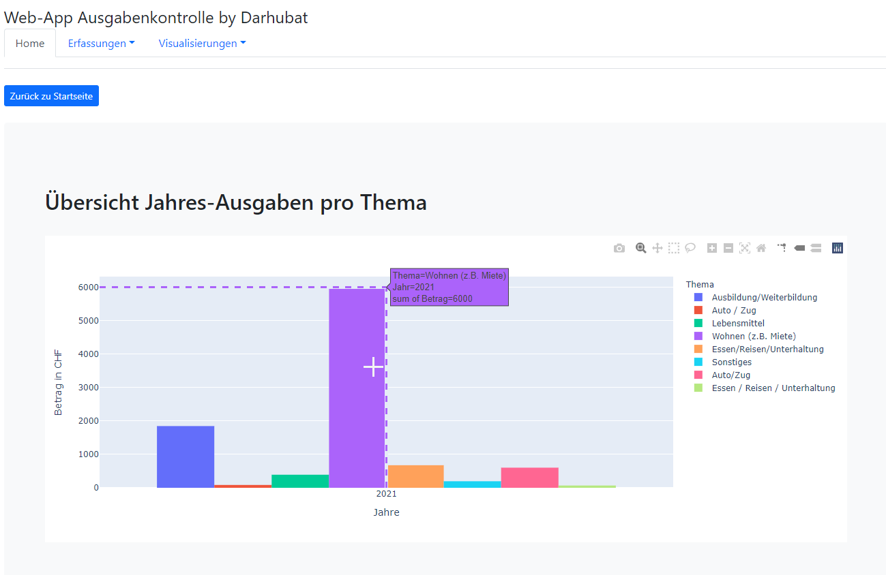

## Ausgangslage
<!-- Italics -->
Im Rahmen des Master-Studiengangs Information & Data Management
an der FH Graubünden soll im Modul Python 2 eine Web-App erstellt werden. Die Programmierung basiert auf Python, wird aber 
mithilfe von PyCharm auf eine Web-Umgebung vorbereitet und auf GitHub dokumentiert.

Für die Startseite wurde auf das bestehende Template "jumbotron" von Getbootstrap zurückgegeriffen. Die Vorlage wurde
entsprechend auf die Bedürfnisse dieser App angepasst bzw. verfeinert und mit weiteren Attributen ergänzt, wie z.B. mit
einer Navbar.

*Quelle:* [https://getbootstrap.com/docs/5.0/examples/jumbotron/](https://getbootstrap.com/docs/5.0/examples/jumbotron/)

***

## Projektidee der App "Ausgabenkontrolle" / Funktionen
<!-- Italics -->
Grundlegend war die **Projektidee**, eine Web-App zu entwickeln, mit der die täglichen
Geldausgaben in ein Formular eingegeben und mit einem Ausgaben-Oberthema gespeichert werden (*inkl. Tagesdatum*).
Gleichzeitig sollten in einem anderen Formular ein Monatsbudget für jeden Monat definiert werden
können, welches ebenfalls abgespeichert wird, aber hier im Monatsformat. Als Abschluss sollen die
monatlichen Ausgaben und das Budget mit einem Diagramm visualisiert werden. Zusätzlich werden die erfassten Ausgaben und
das Budget in einer Tabelle übersichtlich dargestellt.

Folgende **Funktionen** beinhaltet die Web-App:
1. Eingabe & Speicherung der Monats-Budgets
2. Eingabe & Speicherung der Tagesausgaben
3. Visualisierung Ausgaben vs. Budget
4. Visualisierung der Ausgaben pro Ausgaben-Thema
5. Tabellen-Übersicht der aktuell geispeicherten Daten

***

## Installationen
<!-- Italics -->
Folgende Programme bzw. Python-Pakete müssen installiert sein, um die Web-App zu nutzen:

* `Python 3.9`
* `PyCharm`
* `Flask`
* `Jinja2`
* `Plotly`
* `Pandas`

Mit folgender `Python-Datei` kann die Web-App "Ausgabenkontrolle" gestartet werden:

[`main.py`](Projekt_App_Ausgabenkontrolle/main.py "main.py")

Die Web-App startet und kann mit einem beliebigen Gerät über die IP-Adresse und Port 5000 aufgerufen werden.

***

## Ordner-Struktur in GitHub
<!-- Italics -->
Die Struktur in GitHub setzt sich wie folgt zusammen:

* `Bilder` *Aufrufen: [hier](Projekt_App_Ausgabenkontrolle/Bilder) klicken.*
* `Datenvisualisierung` *Aufrufen: [hier](Projekt_App_Ausgabenkontrolle/Datenvisualisierung) klicken.*
* `Formulare` *Aufrufen: [hier](Projekt_App_Ausgabenkontrolle/Formulare) klicken.*
* `static` *Aufrufen: [hier](Projekt_App_Ausgabenkontrolle/static) klicken.*
* `templates` *Aufrufen: [hier](Projekt_App_Ausgabenkontrolle/templates) klicken.*

***

## Workflow
### Dateneingabe
<!-- Italics -->
Die Dateneingabe der täglichen Geldausgaben, wie auch das monatlich definierte Budget könne über vordefinierte Formular 
eingegeben und gespeichert werden. Bei den Ausgaben wird auch noch ein Oberthema ausgewählt, mit dem die Ausgaben klassifiziert
werden. Damit kann ich pro Jahr auswerten, wofür ich mein ganzes Geld ausgegeben habe.
### Speicherung / Datenverarbeitung
<!-- Italics -->
Die erfassten täglichen Ausgaben und monatlichen Budget werden mit dem Datum in eine JSON-Datei gespeichert. Die erfolgreiche
Speicherung wird dabei in der App angezeigt und über einen Button kann danach ausgewählt werden, ob eine weitere Eingabe
gemacht werden möchte oder zurück auf die Startsteite navigiert werden soll. Die Daten werden danach mithilfe von Pandas auf Monatsbasis
verdichtet und für die Visualisierung in eine einheitliche Tabelle geschrieben.
### Datenvisualisierungen
<!-- Italics -->
Folgende Visualisierungen wurden dabei mit `plotly`realisiert, die über verschiedene Buttons auf der Startseite aufgerufen werden können:

* Tabellarische Übersicht aller bisher erfassten Tabes-Ausgaben
* Tabellarische Übersicht aller bisher erfassten Monats-Budgets
* Histogramm: Vergleich der erfassten Ausgaben vs. Budget (interaktiv mit Zeitraumeingrenzung)
* Historgramm: Zusammenfassung der Ausgaben pro Jahr und Oberthema (z.B. Miete, Lebensmittel, etc.)

***

## Ablaufdiagramm
<!-- Italics -->

***

## Benutzeranleitung
### Startseite
<!-- Italics -->
Von der `Startseite` aus können alle Funktionen der Web-App abgerufen werden. Des Weiteren lässt sich von jeder Seite auch
wieder zurück navigieren über den entsprechenden Button `Startseite` oder über die Navbar `Home`. Alle Aktionen können
ebenfalls über die Navbar erreicht werden, über die Auswahl `Home`, `Erfassungen` und `Visualisierungen`.

### Tages-Ausgabe erfassen
<!-- Italics -->
Mit dem Button `Ausgaben erfassen` kann ein neues Formular für die Erfassung einer Tages-Ausgabe abgerufen werden.

Auf dem Formular müssen die Felder `Nr. Tageserfassung`, `Datum der Ausgabe`, `CHF` und das `Ausgaben-Thema` erfasst werden.
Anschliessend können mit dem Button `speichern` die Eingaben in der JSON-Datei `ausgaben.json` gespeichert werden.

Ob die Ausgabe erfolgreich gespeichert wurde, siehst du anhand der folgenden Ansicht:

Du kannst nun mit dem Button `Weitere Ausgabe erfassen` ein neues Ausgabe-Formular aufrufen und die nächste Ausgabe erfassen
oder mit dem Button `Startseite` wieder zurück auf die Startseite navigieren.

### Monats-Budget erfassen
<!-- Italics -->
Mit dem Button `Budget erfassen` kann ein neues Formular für die Erfassung eines Monats-Budget abgerufen werden.

Auf dem Formular müssen die Felder `Monat / Jahr` und `CHF` erfasst werden.
Anschliessend können mit dem Button `speichern` die Eingaben in der JSON-Datei `budget.json` gespeichert werden.

Ob die Ausgabe erfolgreich gespeichert wurde, siehst du anhand der folgenden Ansicht:

Du kannst nun mit dem Button `Weiteres Budget erfassen` ein neues Budget-Formular aufrufen und den nächsten Budget-Monat erfassen
oder mit dem Button `Startseite` oder `Home` in der Navbar wieder zurück auf die Startseite navigieren.

### Übersicht erfasste Ausgabe- und Budget-Daten 
<!-- Italics -->
Mit den Buttons `Übersicht: Erfasst Ausgaben` bzw. `Übersicht: Erfasste Budgets` kannst du deine bereits erfassten Daten
mithilfe einer interaktiven Plotly-Tabelle abrufen und hast somit immer die Übersicht über alle getätigten Erfassungen.

Mit dem Button `Startseite` oder `Home` in der Navbar kannst du auch wieder einfach zurück auf die Ausgangs-Seite navigieren.

### Auswertungen bzw. Visualisierungen aufrufen
<!-- Italics -->
Mit den Buttons `Grafik: Ausgaben vs. Budget` bzw. `Grafik: Ausgaben-Thema` kannst du zwei unterschiedliche Visualisierungen
abrufen über die Startseite der Web-App abrufen (siehe im Bild unten).

Beim ersten Histogramm, welches mithilfe von `Plotly` erstellt wurde, siehst du, für was (Ausgaben-Thema) du dein Geld pro Jahr
ausgegeben hast und kannst damit die grössten Kostenverursacher identifizieren.

Bei der zweiten Grafik, welches mithilfe von `Plotly Express` erstellt wurde, kannst du deine erfassten Tages-Ausgaben vergleichen
mit den erfassten Monats-Budgets und siehst, wo du mehr Ausgaben als budgetiert hattest. Das Histogramm ist interaktiv und 
kann mittels Slicer oder obenstehenden Buttons im Ansichts-Zeitraum eingeschränkt werden.

Mit dem Button `Startseite` kannst du auch bei den Grafiken jederzeit wieder auf die Startseite navigieren und
deine nächste Aktion auswählen.

***
